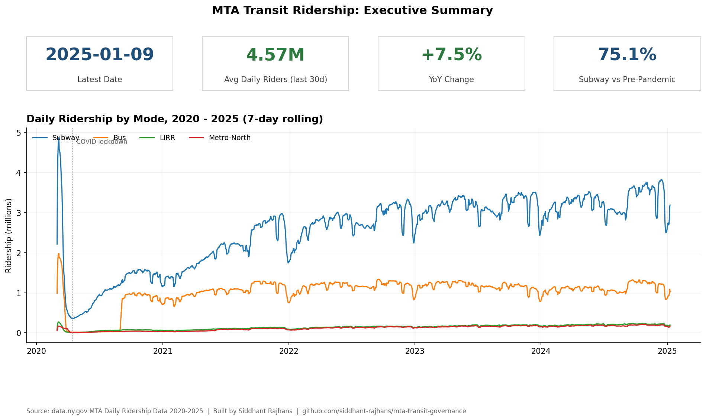
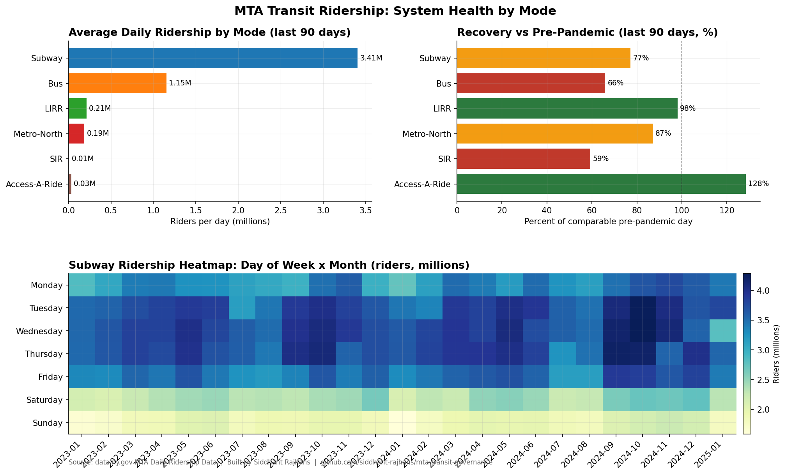
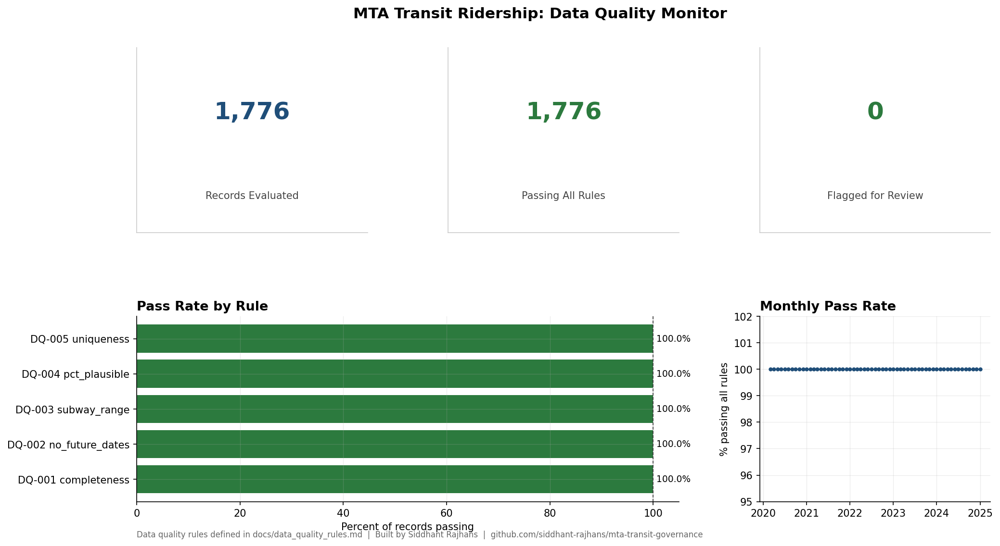

# MTA Transit Data Governance Dashboard


A dashboard on MTA's public ridership data, plus the governance docs
that should come with any dataset before it's trusted: a data
dictionary, quality rules, a lineage map, and a one-page AI/ML
governance memo.

I made this while applying for MTA's Enterprise Architecture fellowship.
The job description asks for dashboards, governance documentation, and
policy research, so I built one of each.



<details>
<summary>More dashboard pages: system health by mode, data quality monitor</summary>





</details>

## What's in here

```
data/
  raw/          downloads from data.ny.gov (gitignored, fetched on demand)
  clean/        cleaned CSVs the dashboard reads
scripts/
  fetch_ridership.py        pulls the source CSVs
  clean_ridership.py        normalizes columns, parses dates, dedupes
  data_quality_checks.py    runs the 5 rules from docs/data_quality_rules.md
  build_dashboard_charts.py renders the dashboard pages as PNGs
dashboard/
  screenshots/  rendered PNG version of the dashboard, three pages
  *.pbix        Power BI file (in progress, build instructions below)
docs/
  data_dictionary.md
  data_quality_rules.md
  data_lineage.md
  ai_governance_memo.md
tests/
  test_data_quality.py  unit tests for each DQ rule + a contract test
                        asserting the committed clean CSV passes all rules
```

## Tests

```bash
python -m pytest tests/ -v
```

Each data quality rule has unit tests against hand-built frames where the
expected outcome is obvious (nulls, future dates, order-of-magnitude
outliers, duplicate dates). A second layer treats the committed cleaned
CSV as a contract: CI fails if a pipeline re-run ever commits data that
breaks a rule, and rebuilds the dashboard charts as a smoke test.

## How to reproduce

```bash
pip install -r requirements.txt
python scripts/fetch_ridership.py
python scripts/clean_ridership.py
python scripts/data_quality_checks.py
python scripts/build_dashboard_charts.py
```

The first step downloads about 330 MB of source data and takes a few
minutes. The rest run in seconds.

## The dashboard

The dashboard exists in two forms.

The PNG version under `dashboard/screenshots/` is what
`build_dashboard_charts.py` produces from the cleaned data. Three pages
covering executive summary, system health by mode, and a data quality
monitor. These are the screenshots you'd see in a Power BI deployment;
I generated them in matplotlib so the dashboard is reproducible without
Power BI Desktop installed.

The Power BI file at `dashboard/MTA_Transit_Dashboard.pbix` mirrors the
same three pages using the same cleaned CSVs as the data source. The
file uses standard Power BI visuals (cards, line, bar, matrix heatmap)
and the same color scheme. If you want to rebuild it from scratch the
data model is straightforward: load `data/clean/daily_ridership.csv`
and `data/clean/dq_results.csv`, build a date dimension off the `date`
column, and use the column names directly. Pre-pandemic percent columns
are decimals (0.75 = 75 percent).

## Data sources

All datasets are public from data.ny.gov.

- MTA Daily Ridership Data 2020 to 2025 (`vxuj-8kew`). The agency's
  most-downloaded dataset. Daily totals across subway, bus, LIRR,
  Metro-North, Access-A-Ride, Staten Island Railway, and Bridges &
  Tunnels. Includes a percent-of-pre-pandemic comparison column per
  mode. About 150 KB.
- MTA Subway Hourly Ridership (`5wq4-mkjj`). Hourly ridership by
  station complex and fare class. About 330 MB.

## Why governance docs

A dashboard without a data dictionary is just a picture. If you want
someone else to trust the numbers, they need to know where the data
came from, what each column means, what counts as bad data, and what
happens when bad data shows up.

The four docs in `docs/` are the minimum I'd want before signing off on
a dataset for production use.

## The AI memo

`docs/ai_governance_memo.md` is a one-pager on what an AI/ML governance
framework at MTA could look like, given the agency's recent moves into
AI camera analytics and fare evasion detection. It references NIST AI
RMF, NYC Local Law 144, and the EU AI Act's risk tiers. It's not a
legal document. It's the kind of memo I'd write for a manager who needs
to brief leadership.

## What this is and isn't

It's a portfolio project. The data is real, the pipeline runs end to
end on public data, the governance docs are written the way I'd
actually write them at work.

It is not a production system, an MTA-endorsed analysis, or a complete
governance framework. It's what one person can do in a few days to
demonstrate the skills the job asks for.

## License

MIT. Use any of it you want.
